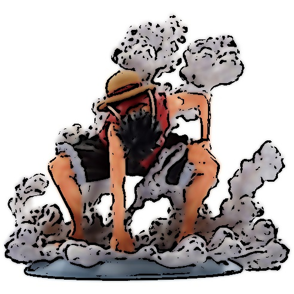

# Cartoon_Rendering
My simple Cartoon Rendering using OpenCV

*Cartoon_Rendering*

## 실행화면

**나의 알고리즘으로 만화 같은 느낌이 잘 표현되는 이미지 데모**
1. 선명한 윤곽선이 있는 이미지
    얼굴, 건물, 사물 등 명확한 테두리가 있는 이미지에서 엣지 검출이 효과적으로 동작함.
2. 적당한 색상의 분포
    색상이 너무 복잡하지 않고, 뚜렷한 영역으로 구분되는 이미지에서 색상 단순화(K-means)가 자연스럽게 적용됨.
3. 배경과 피사체가 분리된 이미지
    배경이 복잡하지 않고 피사체(사람, 사물 등)가 두드러지는 경우, 윤곽선과 색상이 잘 조합됨.

**나의 알고리즘으로 만화 같은 느낌이 잘 표현되지 않는 이미지 데모**
1. 부드러운 색상 변화가 많은 이미지
    그라데이션이 많은 풍경이나 하늘 같은 경우, K-means 클러스터링이 부자연스러운 색상을 만들어낼 수 있음.
2. 노이즈가 많거나 저해상도 이미지
    엣지 검출이 작은 픽셀 노이즈에도 반응하여 원하지 않는 윤곽선이 생길 수 있음.
3. 피사체와 배경의 구분이 애매한 이미지
    배경과 피사체가 비슷한 색을 가지면 엣지 검출이 효과적으로 동작하지 않을 수 있음.

**나의 알고리즘의 한계점에 대해 작성**
1. 엣지 검출의 한계
- 적절한 엣지 검출 기준이 필요함
Canny, Laplacian 등의 엣지 검출 방법이 단순히 밝기 차이를 기반으로 하기 때문에, 디테일이 너무 강조되거나 반대로 엣지가 사라질 수 있음.
- 적용할 이미지에 따라 엣지 검출 파라미터 조정이 필요함
특정 이미지에서는 너무 많은 윤곽선이 검출될 수도 있고, 일부는 검출되지 않을 수도 있음.
2. 색상 단순화(K-means)의 한계
- K 값을 고정하면 다양한 이미지에서 최적의 색상 개수를 찾기 어려움
특정 이미지에서는 9개의 색상이 적절하지만, 어떤 이미지에서는 5개가 더 자연스러울 수도 있음.
- 색상 경계를 너무 인위적으로 만들 가능성이 있음
K-means로 색상을 줄이는 과정에서 자연스러운 색상 변화가 사라질 수 있음.
3. 디테일 유지의 어려움
- 작은 디테일이 손실될 수 있음
작은 텍스처나 미세한 부분은 색상 단순화 과정에서 제거될 가능성이 있음.
- 복잡한 이미지에서는 윤곽선과 색상의 조화가 깨질 수 있음
지나치게 복잡한 이미지에서는 엣지 검출과 색상 단순화가 어울리지 않을 수 있음.